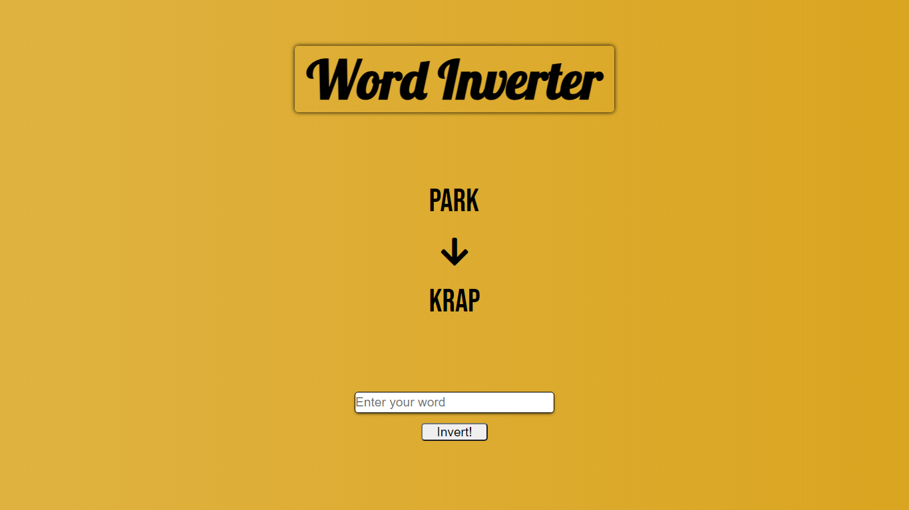

# String-reverser-web-project

Simple web project to reverse a string

In this project i used HTML to test the communication with JS, put in practice the topics about margins, positions and centralized elements that i studied with CSS and with JavaScript i used a simple reverse string algorithm and methods to manipulate HTML elements

